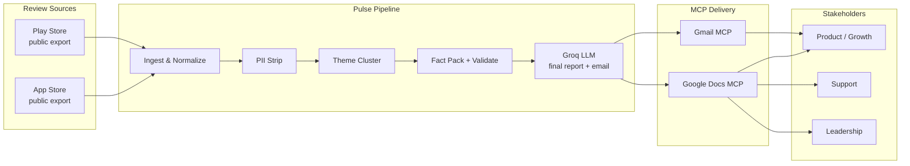
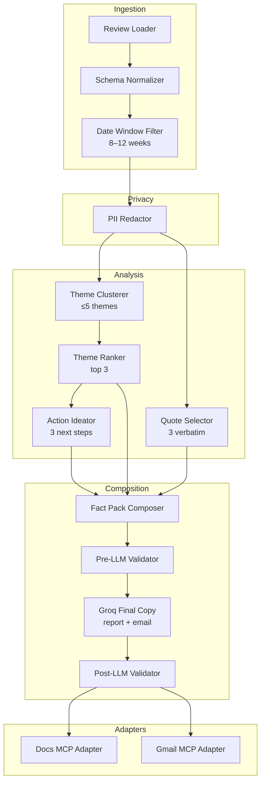
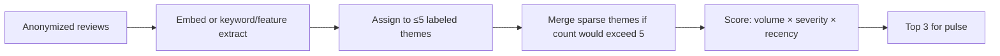
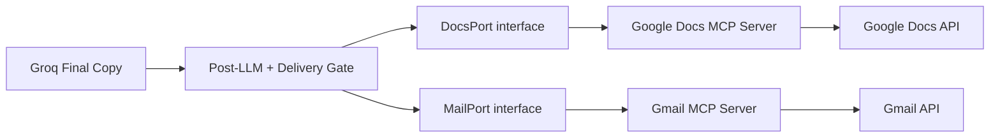
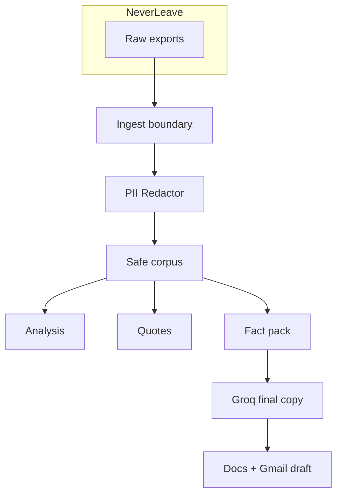

# Architecture: Weekly Mobile-Store Review Pulse

## 1. Overview

### Purpose

A weekly pipeline that ingests public App Store and Play Store reviews, clusters them into themes, builds a validated fact pack, uses **Groq LLM** to write the final one-page report and draft email (≤250 words), then publishes via MCP to Google Docs and creates a Gmail draft—without bespoke OAuth/REST clients for Google.

### Design Principles

| Principle | Implication |
|-----------|-------------|
| MCP-first delivery | Docs and Gmail via MCP tools only; no custom Google API clients |
| **Groq-before-delivery** | Final report + email are written by Groq; Docs/Gmail MCP must not run without successful Groq copy (when `require_before_delivery`) |
| Public data only | Reviews from public exports; no login scraping or ToS-violating automation |
| Privacy by default | Strip PII before clustering, quoting, or publishing |
| Scannable output | ≤5 themes clustered; pulse highlights top 3; ≤250 words |
| Verbatim evidence | Quotes are real review snippets—never invented (Groq must not rewrite quotes) |
| Agent-operable | Pipeline stages are callable as tools/steps by an agent or scheduled runner |

---

## 2. High-Level System Context



**System boundary:** The pipeline owns ingest → normalize → anonymize → cluster → fact pack → **Groq final copy** → MCP publish. Google credentials live in MCP server config; **`GROQ_API_KEY`** lives in environment/secrets—not in application source.

---

## 3. Logical Components



### Component Responsibilities

| Component | Responsibility |
|-----------|----------------|
| **Review Loader** | Load App Store / Play Store public exports (CSV, JSON, or platform export files) |
| **Schema Normalizer** | Map heterogeneous fields → canonical review model (`rating`, `title`, `text`, `date`, `store`) |
| **Date Window Filter** | Keep reviews from the last 8–12 weeks |
| **PII Redactor** | Remove usernames, emails, device IDs, and other identifiers from text used downstream |
| **Theme Clusterer** | Assign each review to at most 5 product-fit themes |
| **Theme Ranker** | Score themes (volume, severity via low ratings, recency) and select top 3 |
| **Quote Selector** | Pick 3 anonymous, verbatim snippets that illustrate top themes |
| **Action Ideator** | Propose 3 concrete next steps grounded in ranked themes |
| **Fact Pack Composer** | Build validated structured facts for Groq (`output/pulse-facts.json`) |
| **Pre-LLM Validator** | Enforce counts, PII, verbatim quotes before calling Groq |
| **Groq Final Copy** | Write stakeholder **final report** + **final email** via Groq API |
| **Post-LLM Validator** | Re-check ≤250 words, PII, verbatim quotes; gate Docs/Gmail |
| **Docs MCP Adapter** | Publish Groq final report to Google Docs via MCP |
| **Gmail MCP Adapter** | Create draft from Groq final email (+ Doc link) via MCP — draft only |

---

## 4. End-to-End Data Flow

```mermaid
sequenceDiagram
  participant R as Runner / Agent
  participant L as Ingest
  participant P as Privacy
  participant A as Analysis
  participant C as Fact Pack + Validate
  participant Q as Groq LLM
  participant D as Docs MCP
  participant G as Gmail MCP

  R->>L: Load public exports (AS + PS)
  L->>L: Normalize schema + filter 8–12 weeks
  L->>P: Canonical reviews
  P->>P: Strip PII
  P->>A: Anonymized reviews
  A->>A: Cluster ≤5 themes
  A->>A: Rank top 3 + pick 3 quotes + 3 actions
  A->>C: Structured pulse payload
  C->>C: Write fact pack + pre-LLM validate
  C->>Q: Generate final report + final email
  Q-->>C: Report + email copy
  C->>C: Post-LLM validate; persist output/
  C->>D: create/update document (Groq report)
  D-->>C: Doc URL / ID
  C->>G: create draft (Groq email + Doc link)
  G-->>C: Draft ID
  C-->>R: Success (Doc link + Draft ID)
```

### Pipeline Stages (ordered)

| Stage | Input | Output | Failure mode |
|-------|-------|--------|--------------|
| 1. Ingest | Export files / paths | Raw store-specific rows | Abort if files missing/unreadable |
| 2. Normalize | Raw rows | Canonical reviews | Drop/skip malformed rows; log counts |
| 3. Window | Canonical reviews | Windowed set | Warn if window empty |
| 4. Redact | Windowed reviews | Anonymized reviews | Fail closed if redaction rules cannot run |
| 5. Cluster | Anonymized reviews | ≤5 themes + memberships | Cap themes at 5; merge leftovers into “Other” if needed |
| 6. Rank & extract | Themes + reviews | Top 3, 3 quotes, 3 actions | Soft-fail quotes if too few reviews; never invent text |
| 7. Fact pack | Structured payload | `pulse-facts.json` | Block Groq on hard pre-LLM validation fail |
| 8. Groq final copy | Validated fact pack | Final report + final email | Retry once; Block Docs/Gmail if still failing / missing API key |
| 9. Post-LLM validate | Groq artifacts | Pass/fail + `output/*` | Block MCP publish on hard failures |
| 10. Publish Doc | Groq final report | Google Doc URL | Retry MCP call; surface tool errors |
| 11. Draft Email | Groq final email + Doc URL | Gmail draft ID | Retry MCP call; do not send—draft only |

---

## 5. Data Model

### Canonical Review

```text
Review {
  id:            string          // stable hash of store + export key (no PII)
  store:         "app_store" | "play_store"
  rating:        1..5 | null
  title:         string | null   // redacted
  text:          string          // redacted body
  date:          ISO-8601 date
  theme_id:      string | null   // set after clustering
}
```

### Theme

```text
Theme {
  id:            string          // e.g. "payments", "onboarding"
  label:         string
  review_ids:    string[]
  metrics: {
    count:       number
    avg_rating:  number | null
    recent_share: number         // fraction in last ~2 weeks of window
  }
}
```

### Pulse Payload (pre-composition)

```text
PulsePayload {
  week_of:       ISO-8601 date   // week ending / report week
  window:        { start, end }
  themes_all:    Theme[]         // ≤5
  themes_top:    Theme[]         // exactly 3 (or fewer if data-poor)
  quotes: [
    { text: string, theme_id: string, store: string, rating: number | null }
  ]                              // exactly 3 when possible; verbatim
  actions: [
    { text: string, theme_ids: string[] }
  ]                              // exactly 3
  stats: {
    total_reviews: number
    by_store: { app_store: number, play_store: number }
  }
}
```

### Published Artifacts

```text
PulseDocument {
  title:         string          // e.g. "Weekly Review Pulse — 2026-W30"
  body:          string          // ≤250 words, scannable
  doc_url:       string          // from Docs MCP
  created_at:    ISO-8601
}

EmailDraft {
  to:            string          // self or alias
  subject:       string
  body:          string          // full note and/or Doc link
  draft_id:      string          // from Gmail MCP
}
```

---

## 6. Theme Clustering Architecture

### Theme Budget

- **Hard cap:** 5 themes total for clustering.
- **Pulse highlight:** Top 3 by rank.
- **Examples (product-dependent):** onboarding, KYC, payments, statements, withdrawals.

### Recommended Approach (flexible)



**Scoring (illustrative):**

\[
score(theme) = w_v \cdot normalize(count) + w_s \cdot normalize(low\_rating\_share) + w_r \cdot normalize(recent\_share)
\]

Weights can favor volume for leadership health checks or severity for product prioritization.

### Quote Selection Rules

1. Must be **verbatim** substrings of redacted review text (or full short reviews).
2. Prefer one quote per top theme when possible.
3. Prefer reviews with concrete detail over one-word praise/complaints.
4. Never synthesize or paraphrase into “fake quotes.”

### Action Ideation Rules

1. Each action maps to one or more top themes.
2. Actions are concrete (“Investigate payment decline errors on Android 14”) not vague (“Improve UX”).
3. Grounded only in observed themes/quotes—no external speculative roadmaps unless clearly labeled.

---

## 7. Pulse Document Shape

Target structure for the **Groq final report** (Google Doc body) and the core of the **Groq final email**:

```text
Weekly Review Pulse — {week_of}
Window: {start} → {end} | N reviews (AS: a, PS: p)

Top themes
1. {theme} — {one-line signal}
2. ...
3. ...

What users said
• "{quote1}"
• "{quote2}"
• "{quote3}"

Suggested next steps
1. {action1}
2. {action2}
3. {action3}
```

**Length:** Entire report ≤250 words where applicable; scannable sections over dense paragraphs.  
**Writer:** Groq LLM produces this copy from the validated fact pack; quotes must remain verbatim.

---

## 8. MCP Integration Architecture

### Why MCP

| Concern | MCP-first approach |
|---------|-------------------|
| Auth | OAuth/tokens configured on the MCP server |
| HTTP plumbing | Encapsulated inside MCP tools |
| Agent ergonomics | Tools discoverable and callable uniformly |
| Course/tooling consistency | Same pattern as other MCP-backed workflows |

### Adapter Pattern



Application code depends on thin **ports** (`createOrUpdateDoc`, `createDraft`) implemented by MCP tool calls—not Google client SDKs. Delivery adapters refuse to publish unless the delivery gate confirms Groq artifacts exist and passed validation.

### Expected Tool Operations (logical)

| Port method | MCP intent |
|-------------|------------|
| `createOrUpdateDoc(title, body)` | Create/update Doc using **Groq final report** as body |
| `getDocLink(docId)` | Return shareable URL for email / stakeholders |
| `createDraft({ to, subject, body })` | Create Gmail **draft** from **Groq final email** (do not auto-send) |

Exact tool names depend on the MCP servers available in the environment; adapters map logical ports → concrete tool names.

### Auth & Secrets

- Google credentials live in MCP server configuration / environment of the host (e.g. Cursor MCP config).
- **`GROQ_API_KEY`** lives in environment / secret store (`config.groq.api_key_env`); never commit keys.
- Pipeline config may hold: export paths, theme labels, recipient alias, Doc naming, Groq model name.
- No OAuth client secrets or Groq keys in application source.

### Groq Final Copy (required before MCP)

| Concern | Approach |
|---------|----------|
| Input | Validated fact pack only (redacted themes, verbatim quotes, actions, stats) |
| Outputs | `output/pulse-latest.md` (report), `output/email-latest.json` (subject + body with `{doc_link}` placeholder) |
| Guardrails | Prompt + post-LLM validator: no invented quotes, no PII, ≤250 words |
| Failure | Fail closed when `require_before_delivery: true` — do not call Docs/Gmail MCP |

---

## 9. Privacy & Compliance Architecture



| Rule | Enforcement point |
|------|-------------------|
| No usernames / emails / device IDs in artifacts | Redactor + Validator |
| Quotes anonymous | Redactor before Quote Selector; Validator regex checks |
| Public exports only | Loader accepts only configured local/export inputs—no authenticated scrape modules |
| Draft not send | Gmail adapter uses draft-create tools only |
| Groq-before-delivery | Delivery gate checks `output/pulse-latest.md` + `output/email-latest.json` |

**PII patterns (minimum):** emails, phone numbers, obvious `@handles`, UUID/device-like tokens, “from: Name” reviewer fields dropped from model entirely.

---

## 10. Runtime & Deployment Options

Either runtime is valid; architecture stays the same.

| Mode | Description |
|------|-------------|
| **Agent-driven** | Operator/agent runs stages via prompts + MCP tools in Cursor (or similar) |
| **Scripted runner** | CLI/cron invokes the same pipeline modules, then calls MCP (or a local MCP host) for publish |

### Suggested Repository Layout

```text
/
├── problemStatement.md
├── architecture.md
├── data/
│   ├── raw/                 # public exports (gitignored if sensitive)
│   └── processed/           # anonymized canonical JSON (optional cache)
├── src/
│   ├── ingest/
│   ├── privacy/
│   ├── analysis/
│   ├── compose/              # fact pack + Groq writer + delivery gate
│   ├── validate/
│   └── adapters/
│       ├── docs_mcp.py
│       └── gmail_mcp.py
├── config/
│   └── pulse.yaml           # window, themes, groq, delivery
└── output/
    ├── pulse-facts.json     # pre-LLM fact pack
    ├── pulse-latest.md      # Groq final report (Docs body)
    └── email-latest.json    # Groq final email (subject + body)
```

---

## 11. Configuration Surface

```yaml
# config/pulse.yaml (illustrative)
window_weeks: 10              # within 8–12
themes:
  max: 5
  labels: [onboarding, kyc, payments, statements, withdrawals]
pulse:
  top_themes: 3
  quotes: 3
  actions: 3
  max_words: 250
delivery:
  docs:
    title_pattern: "Weekly Review Pulse — {iso_week}"
  gmail:
    to: "you@example.com"     # or alias
    subject_pattern: "Weekly Review Pulse — {iso_week}"
    include_doc_link: true
    include_full_body: true
privacy:
  strip_fields: [username, author, email, device_id]
groq:
  enabled: true
  model: llama-3.3-70b-versatile
  api_key_env: GROQ_API_KEY
  temperature: 0.2
  max_tokens: 1200
  require_before_delivery: true
```

---

## 12. Error Handling & Observability

| Class | Strategy |
|-------|----------|
| Empty window | Groq writes short “no reviews in window” copy; do not invent themes |
| Too few themes | Publish with fewer than 3 themes; state data limitation in note |
| Groq / missing API key | Retry once; keep fact pack; **block Docs/Gmail** if `require_before_delivery` |
| MCP tool failure | Retry transient errors; persist Groq `output/*`; surface tool error to operator |
| Validation failure | Block Groq (pre) or Block MCP (post); write local diagnostic report |
| Partial store data | Proceed with available store; note AS/PS counts in header |

**Metrics to log each run:** review counts in/out, themes produced, word count, Groq model, pre/post-LLM validation, Doc ID, Draft ID.

---

## 13. Non-Goals

- Building a custom Google OAuth + REST integration as the primary path
- Scraping stores behind login or violating platform ToS
- Auto-sending email (draft only)
- Unlimited theme taxonomies or long-form multi-page reports
- Retaining reviewer identity for CRM/support ticketing
- Publishing Docs/Gmail while skipping Groq final copy (when `require_before_delivery`)
- Committing `GROQ_API_KEY` or Google OAuth material to the repo

---

## 14. Constraint Traceability

| Requirement (problem statement) | Architectural enforcement |
|---------------------------------|---------------------------|
| Import 8–12 weeks of reviews | Date Window Filter + config `window_weeks` |
| ≤5 themes; pulse top 3 | Theme Clusterer cap + Theme Ranker |
| 3 quotes, 3 actions | Quote Selector + Action Ideator + Validators |
| Groq final report + email before delivery | Groq Final Copy + Delivery Gate |
| Google Docs delivery | Docs MCP Adapter (Groq report body) |
| Gmail draft to self/alias | Gmail MCP Adapter (Groq email, draft-only) |
| ≤250 words | Groq prompts + Post-LLM Validator |
| No PII | PII Redactor + Pre/Post Validators |
| Public exports only | Review Loader (no scrape module) |
| MCP-first, not manual Google APIs | Ports implemented only via MCP tools |

---

## 15. Success Mapping

| Success criterion | Component / artifact |
|-------------------|----------------------|
| Reviews imported 8–12 weeks (AS + PS) | Ingest output stats |
| ≤5 themes; top 3 in pulse | Analysis + Groq report |
| 3 verbatim anonymous quotes | Quote Selector + redacted corpus + post-LLM check |
| 3 grounded action ideas | Action Ideator + Groq report |
| Groq wrote final report + email | `output/pulse-latest.md`, `output/email-latest.json` |
| Pulse in Google Docs via MCP | Docs MCP Adapter result |
| Gmail draft via MCP | Gmail MCP Adapter result |
| ≤250 words, scannable | Post-LLM Validator |
| No PII in artifacts | Privacy gate + Validators |
