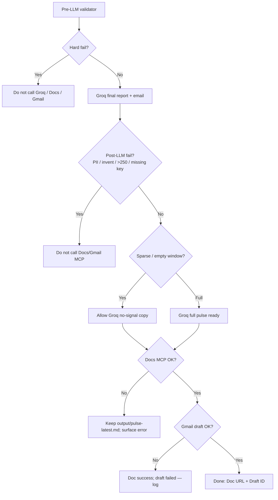

# Edge Cases & Corner Scenarios

Handling rules for the Weekly Mobile-Store Review Pulse pipeline. Aligned with `problemStatement.md`, `architecture.md`, and `implementationPlan.md`.

**Severity legend**

| Level | Meaning |
|-------|---------|
| **Block** | Stop pipeline; do not publish Docs/email |
| **Degrade** | Continue with reduced content; document limitation in pulse |
| **Skip** | Drop offending rows; continue with remainder |
| **Retry** | Transient failure; retry then surface error |

---

## 1. Ingest & Source Data

| ID | Scenario | Severity | Detection | Handling |
|----|----------|----------|-----------|----------|
| I-01 | Both export files missing | **Block** | Path check at loader start | Abort with clear message; no Doc/draft of invented data |
| I-02 | One store export missing | **Degrade** | Per-store path check | Proceed with available store; header shows `AS: n, PS: 0` (or vice versa) |
| I-03 | File unreadable / wrong encoding | **Block** or **Skip** | Open/decode error | Prefer Block if entire file fails; if encoding recoverable, retry UTF-8 / latin-1 once then Block |
| I-04 | Empty file (headers only) | **Degrade** | Zero data rows | Treat as empty store contribution; if both empty → empty-window path (W-01) |
| I-05 | Unexpected columns / schema drift | **Skip** + warn | Required fields missing after mapping | Map known aliases; skip rows without `text`+`date`; log unmapped columns |
| I-06 | Malformed row (bad JSON, ragged CSV) | **Skip** | Parse exception | Skip row; increment `dropped_malformed`; continue |
| I-07 | Duplicate reviews across exports | **Skip** | Same stable `id` or same store+key | Keep first (or newest by date); log duplicate count |
| I-08 | Same review text, different IDs | **Degrade** | Exact text+store+date hash | Dedupe optional; if kept, clustering may inflate theme counts—prefer dedupe by content fingerprint |
| I-09 | Export mixes multiple apps/products | **Block** or filter | App ID / package column if present | Filter to configured product; if cannot disambiguate, Block with operator message |
| I-10 | Operator provides scraped/login dump | **Block** (policy) | Out of band / runbook | Refuse; only configured public-export loaders; no scrape modules |

### Corner notes

- **Partial store is success**, not failure—leadership still gets a pulse.
- Never invent reviews to “fill” a missing store.

---

## 2. Dates & Window (8–12 Weeks)

| ID | Scenario | Severity | Detection | Handling |
|----|----------|----------|-----------|----------|
| W-01 | Zero reviews in window | **Degrade** | Count after filter = 0 | Compose short “No reviews in window {start}→{end}” note; **do not invent themes/quotes/actions**; still allow Docs + draft stating no signal |
| W-02 | All reviews older than window | **Degrade** | Same as W-01 | Same empty-window artifact; log oldest/newest dates seen |
| W-03 | `window_weeks` outside 8–12 | **Block** | Config validation | Reject run until config fixed (hard product constraint) |
| W-04 | Ambiguous / timezone-less dates | **Skip** or normalize | Parse failure or naive date | Assume UTC date-only; skip unparseable; log count |
| W-05 | Future-dated reviews | **Skip** | `date > today` | Drop; likely export glitch |
| W-06 | Window boundary inclusivity | — | Spec | Inclusive start/end by calendar date; document in runbook |
| W-07 | Sparse window (1–5 reviews) | **Degrade** | Low count | Proceed; allow fewer than 3 themes/quotes if needed; state “limited sample (N reviews)” in header |
| W-08 | Reviews clustered on one day (spike) | **Degrade** | Optional | Do not special-case volume; ranking may surface spike themes—valid signal |

---

## 3. Normalization & Fields

| ID | Scenario | Severity | Detection | Handling |
|----|----------|----------|-----------|----------|
| N-01 | Missing review text (title only) | **Degrade** | `text` empty | Use title as text if present; else Skip row |
| N-02 | Missing title | — | null title | Allowed; `title = null` |
| N-03 | Missing rating | — | null rating | Allowed; severity scoring ignores nulls or treats as neutral |
| N-04 | Rating out of range (0, 6, “five”) | **Skip** or coerce | Validate 1–5 | Coerce known strings (“5 stars”→5); else null rating, keep text |
| N-05 | Empty string after trim | **Skip** | `text.strip() == ""` | Drop row |
| N-06 | Extremely long review | **Degrade** | Length > threshold (e.g. 5k chars) | Truncate for clustering features only; keep full text available for verbatim quote up to a safe quote max (e.g. 280 chars) |
| N-07 | Non-English / mixed language | **Degrade** | Optional lang detect | Keep; theme via keywords may miss—prefer “Other” over dropping; never invent translated quotes |
| N-08 | Emoji-only or gibberish | **Skip** or weak | Low alphanumeric ratio | Skip if no usable tokens; else assign “Other” |
| N-09 | HTML / markdown artifacts in export | **Degrade** | Tags present | Strip tags before redaction/cluster; quotes from cleaned text must still be verbatim of cleaned corpus |

---

## 4. Privacy (PII)

| ID | Scenario | Severity | Detection | Handling |
|----|----------|----------|-----------|----------|
| P-01 | Email / phone in body | — | Regex | Redact to `[email]` / `[phone]` before analysis |
| P-02 | Username / “Contact me @…” | — | Patterns | Redact handles; drop author fields entirely from model |
| P-03 | Device ID / UUID / IMEI-like | — | Patterns | Redact tokens |
| P-04 | Reviewer names themselves (“I’m Sarah…”) | **Degrade** | Optional NER / heuristics | Best-effort redact first-person name patterns; Validator re-scans final pulse |
| P-05 | PII only in fields not mapped | — | Schema | Never copy unmapped identity columns into canonical model |
| P-06 | Redactor throws / misconfigured | **Block** | Exception / fail-closed flag | Abort; do not publish unredacted content |
| P-07 | Quote still matches PII after redaction | **Block** publish | Validator PII scan | Reject quote set; re-pick or Block with diagnostic |
| P-08 | Doc/email would include raw export path with usernames | **Skip** | Path hygiene | Never attach raw files; only composed pulse + Doc link |

**Hard rule:** Prefer missing a quote over publishing identifiable text.

---

## 5. Theme Clustering (≤5) & Ranking (Top 3)

| ID | Scenario | Severity | Detection | Handling |
|----|----------|----------|-----------|----------|
| T-01 | More than 5 natural themes emerge | — | Theme count | Cap at 5; merge lowest-volume into “Other” or nearest label |
| T-02 | All reviews map to one theme | **Degrade** | Unique themes = 1 | Pulse shows 1 top theme; state limitation; still produce 3 quotes/actions if possible from that theme |
| T-03 | Fewer than 3 themes with any mass | **Degrade** | Rankable themes < 3 | Publish available themes (1–2); do not invent empty theme slots |
| T-04 | Zero assignable themes (empty text corpus) | **Degrade** | Follows W-01 / empty | Empty-window style note |
| T-05 | Config lists >5 labels | **Block** | Config validation | Fix config; hard cap is product constraint |
| T-06 | Config labels empty | **Block** | Config validation | Require ≥1 label or a default set |
| T-07 | Tie in ranking scores | — | Equal scores | Deterministic break: higher count → lower avg rating → alphabetical `id` |
| T-08 | “Other” dominates top 3 | **Degrade** | Other in top | Prefer promoting next specific theme if Other is catch-all; if unavoidable, one-line note that feedback is heterogeneous |
| T-09 | Theme with reviews but all 5★ praise | — | Metrics | Still valid; action may be “amplify / keep investing” not only bugfixes |
| T-10 | Conflicting signals in one theme | **Degrade** | Mixed ratings | Theme one-liner should reflect split; quotes may show both sides if space |

---

## 6. Quotes (Exactly 3 When Possible)

| ID | Scenario | Severity | Detection | Handling |
|----|----------|----------|-----------|----------|
| Q-01 | Fewer than 3 usable reviews | **Degrade** | Usable count < 3 | Emit N quotes (N<3); never invent; note “limited quotes” |
| Q-02 | Reviews too short for a quote (“Good”, “Bad”) | **Skip** candidate | Length / token rules | Prefer longer concrete reviews; if only shorts exist, use short verbatim or fewer quotes |
| Q-03 | Best quote contains residual PII | **Skip** candidate | PII scan | Pick next candidate; see P-07 |
| Q-04 | Cannot cover one quote per top theme | **Degrade** | Coverage | Prefer theme diversity; allow 2 from one theme if needed |
| Q-05 | Quote would exceed word budget | — | Composer | Truncate with ellipsis **only if** truncated string remains a verbatim prefix/substring; prefer shorter alternate quote |
| Q-06 | Operator asks to “polish” wording | **Block** (policy) | Review process | Forbidden—quotes stay verbatim |
| Q-07 | Duplicate near-identical quotes | **Skip** | Similarity | Prefer distinct snippets |
| Q-08 | Quote from review outside top themes | **Degrade** | theme_id check | Prefer top-theme quotes; allow fallback only if top themes lack usable text |

---

## 7. Actions (Exactly 3)

| ID | Scenario | Severity | Detection | Handling |
|----|----------|----------|-----------|----------|
| A-01 | Fewer than 3 themes | **Degrade** | Theme count | Still produce 3 actions if evidence exists (multiple angles on same themes); or fewer actions with limitation note |
| A-02 | No clear actionable signal (all praise) | **Degrade** | Sentiment | Actions may be reinforce/monitor (“Keep payments reliability; track 5★ mentions of speed”)—still concrete, not vague |
| A-03 | Action not grounded in themes | **Block** validate | theme_ids empty / unknown | Reject; regenerate or Block publish |
| A-04 | Vague actions (“Improve UX”) | **Block** validate | Heuristic / checklist | Require concrete verb + object + optional platform/context |
| A-05 | Actions duplicate each other | **Skip** / regenerate | Near-duplicate text | Ensure 3 distinct next steps |

---

## 8. Composition & Word Limit (≤250)

| ID | Scenario | Severity | Detection | Handling |
|----|----------|----------|-----------|----------|
| C-01 | Draft exceeds 250 words | — | Word count | Trim signal lines, shorten theme blurbs, swap long quotes; Validator fails until ≤250 |
| C-02 | Trimming would destroy required sections | **Degrade** | Structure check | Keep all section headers; shorten bodies; if still over, shorten quotes first (see Q-05) |
| C-03 | Exactly 250 words | — | Count | Pass |
| C-04 | Non-English word counting | — | Locale | Count whitespace-separated tokens; document method in runbook |
| C-05 | Empty optional sections | — | Structure | Omit empty “What users said” only if Q-01; never leave placeholder lorem |

**Pulse shape on degrade (example empty / sparse):**

```text
Weekly Review Pulse — {week_of}
Window: {start} → {end} | N reviews (AS: a, PS: p)
Note: Limited or no review signal in this window.

Top themes
(none / 1–2 listed)

What users said
(none or fewer than 3)

Suggested next steps
1. Re-check exports and window next week
2. …
```

---

## 9. Validation Gate

| ID | Scenario | Severity | Detection | Handling |
|----|----------|----------|-----------|----------|
| V-01 | Hard constraint fail (PII, invented quote, >250, >5 themes) | **Block** | Validator | Write diagnostic; **no MCP publish** |
| V-02 | Soft constraint fail (2 quotes, 2 themes) | **Degrade** | Validator warn | Allow publish if policy flag `allow_sparse=true` and note appears in body |
| V-03 | Stats disagree with body | **Block** | Consistency check | Fix composer; do not publish inconsistent counts |
| V-04 | Local Groq report missing (`pulse-latest.md`) | **Block** | File check | Groq must write report before Docs MCP |
| V-05 | Local Groq email missing (`email-latest.json`) | **Block** | File check | Groq must write email before Gmail MCP |
| V-06 | Delivery attempted while skipping Groq | **Block** | Delivery gate | Enforce `require_before_delivery` |

---

## 9b. Groq LLM Final Copy

| ID | Scenario | Severity | Detection | Handling |
|----|----------|----------|-----------|----------|
| G-01 | `GROQ_API_KEY` missing | **Block** | Env lookup via `api_key_env` | Do not call Docs/Gmail; surface setup message |
| G-02 | Groq API timeout / 5xx | **Retry** → **Block** | HTTP/SDK error | One retry with backoff; keep fact pack; block delivery |
| G-03 | Groq invents / rewrites quotes | **Block** | Post-LLM verbatim check | Retry with stricter prompt once; then Block |
| G-04 | Groq report >250 words | **Retry** → **Block** | Word count | Ask Groq to shorten once; then Block |
| G-05 | Groq output contains PII | **Block** | Post-LLM PII scan | Do not publish; redact fact pack / fix upstream |
| G-06 | Empty window fact pack | **Degrade** | Sparse flag | Groq writes explicit “no signal” copy; still allowed through gate |
| G-07 | `groq.enabled: false` but `require_before_delivery: true` | **Block** | Config check | Invalid config — enable Groq or relax require flag intentionally |
| G-08 | Malformed JSON email artifact | **Block** | Parse error | Re-run Groq; do not draft Gmail |
| G-09 | Fact pack too large for `groq.limits.tpm` (estimated prompt tokens leave no useful completion budget) | **Block** | `src/compose/rate_limit.clamp_max_tokens` pre-call estimate | No API call made; shrink the fact pack (already compacted for the prompt) — retrying as-is cannot succeed |
| G-10 | Groq 429 rate limit mid-run (RPM/TPM) | **Retry** → **Block** | `groq.RateLimitError`, `Retry-After` header | Backoff (`Retry-After` if present, else exponential, capped ~65s), up to 3 attempts; then Block |
| G-11 | Local daily usage log shows `rpd`/`tpd` already exhausted for today | **Block** | `GroqUsageTracker.check_daily_budget` (best-effort, `output/groq-usage.json`) | No API call made; wait until tomorrow or raise the plan's daily limits |

---

## 10. Google Docs MCP Delivery

| ID | Scenario | Severity | Detection | Handling |
|----|----------|----------|-----------|----------|
| D-01 | MCP server unavailable | **Retry** → **Block** publish | Connection / tool error | Retry with backoff; keep Groq markdown; surface error |
| D-02 | Auth expired / insufficient scopes | **Block** | 401/403 from tool | Operator fixes MCP config; no fallback to custom OAuth client in-app |
| D-03 | Create succeeds, link unavailable | **Degrade** | Missing URL | Proceed to Gmail with full Groq email body only; log warning |
| D-04 | Update vs create ambiguity (same week re-run) | — | Title / stored doc id | Prefer update existing weekly Doc if id cached; else create new with same title pattern and note “rerun” |
| D-05 | Doc body too large for tool | **Degrade** | Tool limit | Unlikely at ≤250 words; if hit, send plain text chunk only |
| D-06 | Partial write / tool timeout | **Retry** | Timeout | Idempotent create/update; verify Doc content if tool allows read-back |
| D-07 | Body not from Groq artifact | **Block** | Delivery gate | Only publish `output/pulse-latest.md` |

---

## 11. Gmail MCP Delivery

| ID | Scenario | Severity | Detection | Handling |
|----|----------|----------|-----------|----------|
| M-01 | MCP unavailable after Doc success | **Retry** → **Degrade** | Tool error | Doc remains valid delivery; log failed draft; operator can paste manually from Doc |
| M-02 | Invalid recipient alias | **Block** draft | Config / tool error | Fix `delivery.gmail.to`; do not send to wrong address |
| M-03 | Accidental use of send tool | **Block** (policy) | Adapter allowlist | Adapter exposes draft-create only; never call send |
| M-04 | Doc link missing (D-03) | **Degrade** | No URL | Draft includes full pulse body |
| M-05 | Duplicate drafts on rerun | **Degrade** | Same subject | Acceptable; optional subject suffix ` — rerun {timestamp}` |
| M-06 | Draft body empty | **Block** | Validation | Require Groq email body and/or link before calling MCP |
| M-07 | Body not from Groq email artifact | **Block** | Delivery gate | Only draft from `output/email-latest.json` |

---

## 12. Runtime, Config & Operations

| ID | Scenario | Severity | Detection | Handling |
|----|----------|----------|-----------|----------|
| O-01 | Missing `pulse.yaml` | **Block** | File check | Abort with setup pointer |
| O-02 | Concurrent two runs same week | **Degrade** | Lock / advisory | Use file lock or accept last-write-wins on Doc; log both Draft IDs |
| O-03 | Clock skew affecting window | **Degrade** | Compare export max date vs system date | Prefer “as of export max date” optional mode documented in config |
| O-04 | Disk full writing `output/` | **Block** | IO error | Abort before MCP so incomplete local state isn’t treated as success |
| O-05 | Agent skips Phase 2 privacy | **Block** (checklist) | Runbook / automated stage order | Pipeline enforces redact before quotes/compose |
| O-06 | Agent skips Groq (Phase 4b) | **Block** | Delivery gate | Docs/Gmail refuse until Groq artifacts + post-LLM pass |

---

## 13. Decision Matrix (Publish or Not)



---

## 14. Required User-Visible Messages

When degrading, the pulse **must** say so briefly (one line), e.g.:

| Condition | Message pattern |
|-----------|-----------------|
| Empty window | `No reviews in this window — no themes invented.` |
| Single store | `Play Store export unavailable; App Store only.` |
| Sparse sample | `Limited sample (N reviews) — fewer than 3 themes/quotes.` |
| MCP draft failed | Operator log only; Doc still has the note |

Never imply completeness when data was partial.

---

## 15. Test Fixtures Checklist

Minimum fixtures to lock edge behavior:

- [ ] Empty CSV / headers only → W-01
- [ ] One store missing → I-02
- [ ] Reviews outside window only → W-02
- [ ] PII-laden review text → P-01–P-03, Q-03
- [ ] <3 reviews total → Q-01, T-03
- [ ] >5 keyword themes → T-01
- [ ] All 5★ short praise → A-02, Q-02
- [ ] Oversized draft → C-01
- [ ] Validator PII fail blocks MCP → V-01
- [ ] Missing Groq key blocks delivery → G-01
- [ ] Groq rewritten quote blocked → G-03
- [ ] Docs MCP error keeps local Groq file → D-01
- [ ] Gmail draft-only (no send) → M-03
- [ ] Skip-Groq delivery blocked → O-06 / V-06
- [ ] Oversized prompt blocked before any API call → G-09
- [ ] 429 mid-run backs off and retries, then blocks → G-10
- [ ] Exhausted daily quota (per local log) blocks further calls → G-11

---

## 16. Traceability

| Constraint | Edge cases that protect it |
|------------|----------------------------|
| Public exports only | I-10 |
| 8–12 week window | W-03, W-01–W-02 |
| ≤5 themes / top 3 | T-01–T-05 |
| Verbatim quotes | Q-06, Q-05, V-01, G-03 |
| No PII | P-*, V-01, G-05 |
| ≤250 words | C-01–C-04, V-01, G-04 |
| Groq before Docs/Gmail | G-01–G-11, V-04–V-06, O-06, D-07, M-07 |
| Respect Groq rate limits (RPM/TPM/RPD/TPD) | G-09, G-10, G-11 |
| MCP-first Docs/Gmail | D-02, M-03 |
| Draft not send | M-03 |
| No invented content | W-01, Q-01, T-03–T-04, G-03 |
