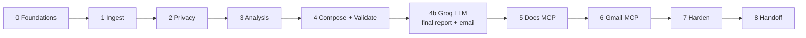

# Implementation Plan: Weekly Mobile-Store Review Pulse

Phase-wise plan derived from `problemStatement.md` and `architecture.md`. Each phase has scope, tasks, exit criteria, and success-criteria coverage so “done” is unambiguous.

---

## Plan at a Glance

| Phase | Name | Outcome |
|-------|------|---------|
| 0 | Foundations | Repo, config, sample exports, MCP servers identified |
| 1 | Ingest & Normalize | Canonical 8–12 week review set from public exports |
| 2 | Privacy Gate | Anonymized corpus; no PII downstream |
| 3 | Theme Analysis | ≤5 themes, top 3 ranked, 3 quotes, 3 actions |
| 4 | Compose & Validate | Structured pulse + constraint checks (pre-LLM gate) |
| 4b | Groq LLM Final Copy | **Groq writes final report + final email** (required before Docs/Gmail) |
| 5 | Docs MCP Delivery | Groq final report published to Google Docs via MCP |
| 6 | Gmail MCP Delivery | Groq final email created as Gmail draft via MCP (not sent) |
| 7 | End-to-End Hardening | Full run, observability, empty/partial-data paths |
| 8 | Handoff | Operator runbook + success checklist signed off |

**Dependency rules:**

- Privacy (Phase 2) must precede any quote or Doc/email content.
- Do not call Groq (Phase 4b) until Phase 4 validation passes on the structured `PulsePayload`.
- Do **not** start MCP Docs/Gmail (Phases 5–6) until Groq has produced the **final report** and **final email**, and both pass a post-LLM constraint re-check (≤250 words where applicable, no PII, quotes still verbatim, no invented quotes).

---

## Phase 0 — Foundations

**Goal:** Project skeleton and decisions ready so later phases plug in without rework.

### Tasks

1. Create repo layout per architecture (`data/raw`, `data/processed`, `src/*`, `config/`, `output/`).
2. Add `config/pulse.yaml` with window (8–12 weeks), theme labels (≤5), pulse counts (3/3/3), max words (250), delivery naming patterns, recipient alias.
3. Obtain **public** App Store and Play Store review exports; place under `data/raw/` (gitignore if needed).
4. Document expected export columns per store (rating, title, text, date, etc.).
5. Identify available **Google Docs** and **Gmail** MCP servers in the environment; note tool names for create/update Doc and create draft.
6. Confirm auth lives in MCP host config—not in app source.
7. Choose runtime mode: agent-driven, scripted runner, or both (architecture allows either).

### Exit criteria

- [x] Layout + `pulse.yaml` exist
- [x] Sample public exports present for both stores (or one store + documented gap)
- [x] Docs/Gmail MCP tools listed and reachable (smoke: list tools) — *listed; not reachable until Docs/Gmail MCP servers are installed (see `docs/phase0/MCP_INVENTORY.md`)*
- [x] No Google OAuth client code planned as primary path

**Phase 0 delivered:** `docs/phase0/FOUNDATIONS.md`

### Maps to

Architecture §§10–11; Problem Statement integrations + constraints.

---

## Phase 1 — Ingest & Normalize

**Goal:** Reliable canonical reviews for the last 8–12 weeks.

### Tasks

1. Implement **Review Loader** for App Store and Play Store public export formats (CSV/JSON as provided).
2. Implement **Schema Normalizer** → canonical `Review` model (`id`, `store`, `rating`, `title`, `text`, `date`).
3. Generate stable non-PII `id` (hash of store + export key).
4. Implement **Date Window Filter** using `window_weeks` from config.
5. Log ingest metrics: rows read, dropped/malformed, kept after window, counts by store.
6. Persist optional `data/processed/canonical.json` for debugging (pre-redaction only if access-controlled; prefer post-redaction in Phase 2).

### Exit criteria

- [x] Both stores load (or graceful partial-store path with logged counts)
- [x] Window respects 8–12 weeks config
- [x] Malformed rows skipped with counts; empty window warned
- [x] No scrape/login automation in codebase

**Phase 1 delivered:** `docs/phase1/INGEST.md` — run `python -m src.ingest.cli --as-of 2026-07-28`

Note: Delivery still requires Phase 4b Groq final copy before Docs/Gmail (`docs/phase4b/GROQ_FINAL_COPY.md`).

### Maps to

Problem Statement: import 8–12 weeks; Architecture stages 1–3.

### Success criteria unlocked

- Reviews imported for last 8–12 weeks (App Store + Play Store, public exports)

---

## Phase 2 — Privacy Gate

**Goal:** Nothing identifiable leaves the safe corpus.

### Tasks

1. Implement **PII Redactor**: drop strip fields (`username`, `author`, `email`, `device_id`); scrub emails, phones, `@handles`, device-like tokens from `title`/`text`.
2. Fail closed if redaction cannot run.
3. Write anonymized corpus to `data/processed/` for analysis.
4. Add unit/fixture tests for common PII patterns.
5. Ensure raw exports are not copied into Docs/email paths.

### Exit criteria

- [x] Downstream modules consume only redacted reviews
- [x] Spot-check: no reviewer names/emails/device IDs in processed output
- [x] Redactor tests cover minimum pattern set from architecture

**Phase 2 delivered:** `docs/phase2/PRIVACY.md` — run `python -m src.privacy.cli --from-ingest --as-of 2026-07-28`

### Maps to

Architecture §9; Problem Statement privacy constraint.

### Success criteria unlocked

- No PII in any artifact (enforced at source; re-checked in Phase 4)

---

## Phase 3 — Theme Analysis

**Goal:** ≤5 themes clustered; top 3 + 3 verbatim quotes + 3 grounded actions.

### Tasks

1. Implement **Theme Clusterer** with hard cap of 5 labels from config (merge sparse into “Other” if needed).
2. Assign `theme_id` on each review (keyword/rules or embeddings—keep simple first).
3. Implement **Theme Ranker** (volume + low-rating severity + recency); select top 3.
4. Implement **Quote Selector**: 3 verbatim snippets from redacted text; prefer one per top theme; never invent.
5. Implement **Action Ideator**: 3 concrete next steps mapped to theme IDs.
6. Emit structured `PulsePayload` (themes_all, themes_top, quotes, actions, stats).

### Exit criteria

- [x] `themes_all.length ≤ 5`
- [x] `themes_top.length ≤ 3` (fewer only if data-poor, documented in payload)
- [x] Exactly 3 quotes when enough reviews; each is substring of a redacted review
- [x] Exactly 3 actions, each linked to ≥1 top theme
- [x] No paraphrased/fake quotes

**Phase 3 delivered:** `docs/phase3/ANALYSIS.md` — run `python -m src.analysis.cli --from-privacy --as-of 2026-07-28`

### Maps to

Architecture §§5–6; Problem Statement clustering + pulse checklist.

### Success criteria unlocked

- ≤5 themes clustered; pulse shows top 3
- 3 verbatim anonymous quotes
- 3 action ideas grounded in themes

---

## Phase 4 — Compose & Validate (pre-LLM gate)

**Goal:** Structured, validated pulse facts ready for Groq final copy—not yet the stakeholder-facing Doc/email.

**Implemented as:** the **Pulse Composer** itself is `PulsePayload.to_fact_pack()` (Phase 3, `src/models.py`), writing `output/pulse-facts.json` at the end of `src/analysis/pipeline.py`. Phase 4's own scope is the **pre-LLM Constraint Validator**, `src/validate/fact_pack.py`, which is the actual gate this phase adds.

### Tasks

1. ~~Pulse Composer~~ — done in Phase 3 (`PulsePayload.to_fact_pack`); Phase 4 consumes `output/pulse-facts.json` as-is rather than rebuilding it.
2. Implement **`validate_fact_pack()`** (`src/validate/fact_pack.py`) enforcing, before any LLM call:
   - theme/quote/action counts vs. `themes.max`, `pulse.top_themes`, `pulse.quotes`, `pulse.actions` (hard error if over; warning if under **and** `pulse.allow_sparse`, else hard error)
   - PII regex re-scan (`src/validate/checks.find_pii`) on every quote/action text field
   - quote verbatim check against `data/processed/anonymized.json` when present (skips with a warning, not a block, if the corpus file isn't co-located)
   - action grounding: every action must reference at least one known `theme_id` (A-03)
   - stats consistency: `stats.total_reviews == sum(stats.by_store.values())` (V-03)
3. Wire the validator as a **hard gate in front of Groq**: `src/compose/groq_writer.write_final_copy()` calls `validate_fact_pack()` first and raises `GroqWriteError` (no API call made) on any hard error, writing `output/pulse-facts.validation.json` for diagnostics.
4. Standalone CLI `python -m src.validate.cli` runs the same check for a "Phase 4 only" run (useful in CI / before spending Groq tokens).
5. Empty window: Phase 3 already emits a fact pack with `limitation_note` and empty theme/quote/action lists; the validator treats the shortfall as a warning (not a block) whenever `pulse.allow_sparse: true`, per Phase 3 behavior—no invented content.

### Exit criteria

- [x] Validated fact pack written locally (`output/pulse-facts.json`, produced by Phase 3)
- [x] Validator passes on sample full dataset (`python -m src.validate.cli` → `OK`)
- [x] Empty-window path produces valid sparse fact pack (warnings only, `ok: true`)
- [x] Failures block progression to Phase 4b (and thus 5–6) — enforced inside `write_final_copy()`

### Maps to

Architecture stages 7–8 (facts), §12; Problem Statement checklist inputs.

---

## Phase 4b — Groq LLM Final Report & Email

**Goal:** Use **Groq** to write the stakeholder-facing **final report** (Google Doc body) and **final email** (Gmail draft body) **before** any Docs or Gmail MCP calls.

This phase is mandatory on the critical path: Phases 5–6 consume Groq outputs only—not raw templates skipped past the LLM.

### Tasks

1. Add Groq client module (`src/compose/groq_writer.py` or similar) using Groq Chat Completions API.
2. Extend `config/pulse.yaml` with Groq settings, e.g.:
   - `groq.model` (e.g. `llama-3.3-70b-versatile` or current recommended model)
   - `groq.api_key_env` (e.g. `GROQ_API_KEY` — key in env only, never committed)
   - `groq.temperature`, `groq.max_tokens` as needed
   - `groq.limits` (`rpm`/`tpm`/`rpd`/`tpd`) — the account's published free-tier limits (e.g. 30/1,000/12,000/100,000 for `llama-3.3-70b-versatile`); see **rate-limit handling** below
2b. **Rate-limit handling** (`src/compose/rate_limit.py`), added because 1,000 TPM is tight enough that a single naive request can exceed it:
   - `compact_fact_pack_for_prompt()` (in `prompts.py`) strips `review_ids` and other fields Groq doesn't need, and serializes without indentation, to minimize prompt tokens
   - `estimate_tokens()` + `clamp_max_tokens()` cap the requested completion so `prompt + completion` fits under `tpm` with a safety margin; if the prompt alone leaves no useful room, **no API call is made** (G-09)
   - 429 (`groq.RateLimitError`) triggers up to 3 retries honoring `Retry-After`, else capped exponential backoff (G-10)
   - `GroqUsageTracker` logs real usage per call to `output/groq-usage.json` and refuses further calls once today's logged usage meets/exceeds `rpd`/`tpd` (G-11, best-effort — client-side only)
3. Implement two prompted writers from the validated fact pack:
   - **Final report** — one-page weekly pulse for Docs: top themes, **verbatim** quotes unchanged, 3 actions, ≤250 words, scannable
   - **Final email** — draft to self/alias: short subject line suggestion + body that includes/summarizes the pulse and a placeholder for `{doc_link}` (filled in Phase 6 after Docs publish)
4. Prompt hard rules (system/user):
   - Do **not** invent quotes; paste quotes exactly as provided
   - Do **not** add PII or reviewer identities
   - Do **not** exceed ~250 words on the report
   - Ground actions only in supplied themes
   - Empty/sparse windows: state limitation; do not fabricate themes
5. Persist artifacts before MCP:
   - `output/pulse-latest.md` — Groq final report
   - `output/email-latest.md` (or `.json` with `subject` + `body`) — Groq final email
6. **Post-LLM re-validation** on both artifacts (word limit, PII scan, verbatim quote presence). On fail: one retry with stricter prompt, then Block Docs/Gmail.
7. Fail closed if `GROQ_API_KEY` missing or Groq API errors after retries—keep fact pack; do not publish half-written copy via MCP.

### Exit criteria

- [x] Groq produces final report + final email from validated fact pack — verified with a live call against real `GROQ_API_KEY` (`python -m src.compose.cli`): 128-word report, valid JSON, 0 retries needed
- [x] Both written under `output/` and pass post-LLM validator — `output/pulse-latest.md`, `output/email-latest.json` written and passed `validate_final_copy` on the first attempt
- [x] Quotes in report/email remain verbatim substrings of the redacted corpus — all 3 quotes in `pulse-latest.md` match `output/pulse-facts.json` character-for-character
- [x] No Docs/Gmail MCP calls occur unless Phase 4b succeeds — enforced by `require_delivery_ready()`; verified both via unit tests and a live run (gate now reports `allowed: True` once Groq artifacts exist)
- [x] API key only via environment / secret store — resolved via `.env` (git-ignored) auto-loaded by `python-dotenv` in `src/config.py`; never read or logged by the agent
- [x] Requests fit the account's rate limits or fail closed with a clear reason — `src/compose/rate_limit.py`; confirmed live: real prompt ~521–576 tokens vs. the 1,000 TPM budget, logged to `output/groq-usage.json`

**Fixed during the live run:** the model was ignoring the "return JSON" instruction and emitting the report as raw markdown (`_parse_llm_json` correctly rejected it rather than accepting malformed output). Fixed by (1) passing `response_format={"type": "json_object"}` to the Groq call to enforce JSON mode, and (2) clarifying the prompt wording so `report_markdown`'s outline isn't mistaken for the top-level response shape.

### Maps to

Problem Statement weekly note + email draft copy; Architecture composition stage with LLM polish; delivery still MCP-first for Google.

### Success criteria unlocked

- Note ≤250 words and scannable (Groq final report)
- Re-confirmed: no PII; quotes/actions present in final copy

---

## Phase 5 — Google Docs via MCP

**Goal:** Stakeholders can open the **Groq final report** in Google Docs.

**Implemented as:** `src/adapters/docs_mcp.py` (`DocsPort`, `DocsMcpAdapter`), `src/compose/render.py` (title rendering), plus `docs-meta.json` caching for idempotent reruns. The MCP tool calls themselves are now **unblocked** — the same Gmail + Google Docs MCP server identified in Phase 6 also exposes the Docs tools this phase needs (see below); remaining work is mapping `SERVER_ID`/`TOOL_*` and one design decision on "update" semantics, not tool selection.

### MCP server identified (unblocks task 2)

Same server as Phase 6 — [`rohinigowdaiah1111/MCP-server`](https://github.com/rohinigowdaiah1111/MCP-server), hosted at `https://mcp-server-ziee.onrender.com` (`/health` confirmed live).

| | |
|---|---|
| Create tool | `docs_create(title, content?)` → creates a new Doc; response is a **text block** `"Document created. ID: <documentId>\nURL: <url>"`, not JSON — the adapter must parse the ID/URL out of that string. |
| "Update" tool | `docs_append_text(documentId, text)` — **append-only**; conflict-safe (reads the doc's current `revisionId`, retries server-side on concurrent-edit conflicts up to `MAX_CONFLICT_RETRIES`). **There is no replace/overwrite tool on this server.** |
| Doc link | No separate `getDocLink`-style tool exists or is needed — the URL is deterministic: `https://docs.google.com/document/d/{documentId}/edit`, and is already returned by both `docs_create` and `docs_append_text`. `DocsMcpAdapter.get_doc_link()` can be pure local string formatting; no MCP round-trip required. |
| Auth / transport | Same as Phase 6: Google OAuth via the server's `/authorize`, remote `/mcp` gated by `MCP_AUTH_TOKEN` bearer. |

**Design decision — D-04 "update" semantics:** since the server can only create a new Doc or append to an existing one (no overwrite), a same-week rerun cannot silently replace the previous body. Recommended behavior: keep the existing `docs-meta.json` cache (`title → doc_id`) for same-week detection, but implement the "update" path as `docs_append_text(existing_doc_id, f"\n\n--- Updated {timestamp} ---\n\n{body}")` rather than a true overwrite — this preserves a dated revision history in the Doc instead of duplicating a whole new Doc per rerun. Document this as the actual contract of `create_or_update_doc()` once wired.

### Tasks

1. Define `DocsPort`: `create_or_update_doc(title, body, *, existing_doc_id=None)`, `get_doc_link(doc_id)`. ✅
2. Implement **Docs MCP Adapter** mapping ports → real MCP tool names. ⏳ set `SERVER_ID = "gmail-docs"`, `TOOL_CREATE_OR_UPDATE = "docs_create"` (create path), add `TOOL_APPEND = "docs_append_text"` (update path — see design decision above). `TOOL_GET_LINK` is no longer needed as an MCP call; derive the URL locally from `documentId`.
3. Render title from config pattern: `render_title()` uses `delivery.docs_title_pattern` (default `Weekly Review Pulse — {iso_week}`) and the Phase 3 fact pack's `week_of`, via `src/compose/render.iso_week_label`. ✅
4. Call MCP **only after Phase 4b success**: `publish_groq_report()` calls `require_delivery_ready()` first (defense in depth, also re-checked inside `create_or_update_doc`); body = `output/pulse-latest.md` (Groq final report)—never skip Groq. ✅
5. **Update vs. create (D-04):** `output/docs-meta.json` caches `{title, doc_id, url}` from the last publish. `publish_groq_report()` passes `existing_doc_id` through when the rendered title matches the cache. ⏳ wire the "update" branch to call `docs_append_text` with the dated-separator format above, not an overwrite.
6. Capture Doc ID/URL in `docs-meta.json`; retry transient MCP errors — ⏳ client-side retry only for errors the server marks `retryable: true` (e.g. `RATE_LIMITED`, `UPSTREAM_ERROR`); `CONFLICT` on `docs_append_text` is already retried server-side.
7. On MCP failure, keep local Groq artifacts and surface error (do not invent success) — `DeliveryBlocked` / `NotImplementedError` propagate; nothing is marked delivered on failure. ✅

### Exit criteria

- [ ] Doc created/updated via MCP from Groq final report (no custom Google REST client) — server identified and live; pending `TOOL_CREATE_OR_UPDATE`/`TOOL_APPEND` wiring in `DocsMcpAdapter` and registering the server in Cursor's MCP config
- [x] Shareable URL available to inject into the Groq email body (`{doc_link}`) — `DocResult.url` → `fill_doc_link()`; now derivable locally from `documentId`, no extra MCP call needed
- [x] Auth remains in MCP config only
- [x] Title rendered from config + real week (`{iso_week}`), not hardcoded — verified live: renders `Weekly Review Pulse — 2026-W31` from the real fact pack's `week_of`
- [ ] Same-week rerun prefers update over duplicate create — redefined as "append a dated revision block" (see design decision); confirm behavior once wired against the real server
- [x] Gate correctly opens once Phase 4b succeeds — verified live: `check_delivery_gate()` → `allowed: True` after a real Groq run; `publish_groq_report()` / `create_draft_from_groq()` both reach the `NotImplementedError` boundary (the real MCP call) rather than stopping earlier

### Maps to

Architecture §8; Problem Statement Docs deliverable.

### Success criteria unlocked

- Pulse published to Google Docs via MCP

---

## Phase 6 — Gmail Draft via MCP

**Goal:** Create a Gmail **draft** using the **Groq final email**, with Doc link filled in—not sent.

**Implemented as:** `src/adapters/gmail_mcp.py` (`MailPort`, `GmailMcpAdapter`). Gate, doc-link fill, and subject fallback are wired. The MCP tool call itself is now **unblocked**: a Gmail + Google Docs MCP server has been identified and is live (see below) — remaining work is mapping `SERVER_ID` / `TOOL_CREATE_DRAFT` to it and a send-tool safety check, not tool discovery.

### MCP server identified (unblocks task 2)

| | |
|---|---|
| Server | **Gmail + Google Docs MCP Server** — [`rohinigowdaiah1111/MCP-server`](https://github.com/rohinigowdaiah1111/MCP-server) |
| Hosting | Deployed remotely on Render: `https://mcp-server-ziee.onrender.com` — `GET /health` confirmed live (`{"status":"ok"}`); Streamable HTTP transport at `/mcp` |
| Draft tool (this phase) | `gmail_create_draft(to, subject, body, cc?, bcc?, isHtml?, attachments?)` — maps to `MailPort.createDraft({ to, subject, body })`, but **`to` is an array of email strings** on this tool (`z.array(z.string().email()).min(1)`), so the adapter must call it with `to=[request.to]`, not the bare string; supports optional `attachments` (not currently used by this pipeline). Response is a **text block** `"Draft created successfully. Draft ID: <id>"`, not JSON — parse the ID out of that string for `DraftResult.draft_id`. |
| Also exposed — **do not wire** | `gmail_send_email`, `gmail_send_draft` — the server *can* send mail, but per architecture non-goal "auto-send" and edge-case M-03, `GmailMcpAdapter` must call **only** `gmail_create_draft`, never these two |
| Also exposed (Phase 5, not this phase) | `docs_create`, `docs_append_text` — resolves `DocsPort` from the same server; out of scope for Phase 6 |
| Other tools | `gmail_list_drafts`, `server_metrics` (per-tool call counts / error rates / latency) |
| Auth model | Two independent layers: (1) **Google OAuth 2.0** — one-time consent via the server's `/authorize?token=<MCP_AUTH_TOKEN>` endpoint (remote equivalent of `npm run authorize`); token stored encrypted (AES-256-GCM) on the server host, never in this repo; (2) **transport auth** — remote `/mcp` calls require `Authorization: Bearer <MCP_AUTH_TOKEN>`, a shared secret set in the server's Render env, not in `config/pulse.yaml` or `.env` here |
| Error contract | Failures come back as `Error [CODE]: message` (`INVALID_INPUT`, `REAUTH_REQUIRED`, `RATE_LIMITED`, `UPSTREAM_ERROR`, `CONFLICT`, `INTERNAL_ERROR`) with a `retryable` hint + `requestId` — adapter retry logic (task 6) should key off `retryable`, not guess |
| Follow-up | Register this server in Cursor's MCP config (`mcp.json`) as e.g. `gmail-docs`, complete the one-time Google authorize step, then fill the `docs/phase0/MCP_INVENTORY.md` tool-name worksheet (`createDraft → gmail-docs → gmail_create_draft`) |

### Tasks

1. Define `MailPort`: `createDraft({ to, subject, body })`. ✅
2. Implement **Gmail MCP Adapter** (draft-create only; no send tool). ✅ adapter code ready; ⏳ set `SERVER_ID = "gmail-docs"` and `TOOL_CREATE_DRAFT = "gmail_create_draft"` once the server above is registered in Cursor's MCP config — replaces the `NotImplementedError` in `create_draft()`.
3. Load Groq email artifact (`output/email-latest.*`); substitute `{doc_link}` with Phase 5 URL when `include_doc_link` is true; optionally append full report if `include_full_body` is true. ✅
4. Prefer Groq-suggested subject when present; else config `subject_pattern` rendered with the real ISO week via `src/compose/render.render_pattern` (`{iso_week}` → e.g. `2026-W31`, not left as a literal placeholder). ✅
5. Recipient = self or configured alias. — maps to `delivery.gmail_to` in `config/pulse.yaml`; no adapter change needed.
6. Log Draft ID; retry transient failures. — ⏳ retry only when the server's error payload marks `retryable: true` (e.g. `RATE_LIMITED`, `UPSTREAM_ERROR`), mirroring `src/compose/rate_limit.sleep_for_retry`'s backoff used for Groq.
7. Never call Groq again inside this phase for "fresh" copy unless Phase 4b is explicitly re-run—delivery uses frozen `output/` artifacts. ✅
8. **New — send-tool guardrail:** since this server (unlike a hypothetical draft-only one) also exposes `gmail_send_email`/`gmail_send_draft`, add an explicit test/assertion that `GmailMcpAdapter` never references `TOOL_SEND`-style constants or calls those two tool names, so a future edit can't accidentally wire sending.

### Exit criteria

- [ ] Draft visible in Gmail drafts via MCP — pending `TOOL_CREATE_DRAFT = "gmail_create_draft"` wiring
- [ ] Draft body is the Groq final email (plus Doc link as configured)
- [ ] No auto-send path exists — **actively verified**, not just absent by omission: the connected server *does* expose send tools, so a test/code-review check must confirm `GmailMcpAdapter` calls only `gmail_create_draft`
- [ ] Remote server reachable + authorized — `/health` OK (confirmed live), Google OAuth completed via `/authorize`, `MCP_AUTH_TOKEN` configured for this server in Cursor's MCP config

### Maps to

Architecture §8; Problem Statement email draft deliverable.

### Success criteria unlocked

- Gmail draft created via MCP

---

## Phase 7 — End-to-End Hardening

**Goal:** One command/agent flow is reliable for weekly use.

### Tasks

1. Wire stages ingest→…→Groq→Docs→Gmail into a single runner (CLI entrypoint and/or agent playbook).
2. Implement partial-store behavior (proceed with available store; note AS/PS counts in header).
3. Add run metrics log: reviews in/out, themes, word count, pre/post-LLM validation, Groq model used, Doc ID, Draft ID.
4. Exercise failure drills: missing file, empty window, validator fail, **Groq down / missing API key**, MCP down.
5. Confirm non-goals still hold (no scrape, no OAuth client, no auto-send, ≤5 themes, no Docs/Gmail without Groq final copy).

### Exit criteria

- [ ] Full happy-path run: exports → Groq final report/email → Doc + Gmail draft
- [ ] Documented behavior for empty/partial/Groq-fail/MCP-fail cases
- [ ] Metrics written each run

### Maps to

Architecture §§4, 12–13; full Problem Statement end-to-end flow.

---

## Phase 8 — Handoff & Sign-off

**Goal:** Another operator can run the weekly pulse without reverse-engineering.

### Tasks

1. Write short runbook: where to drop exports, how to set config, how to run, where to find Doc/draft.
2. Fill success checklist from Problem Statement against a real run.
3. List MCP tool names used, Groq model, and env prerequisites (`GROQ_API_KEY`, MCP auth).
4. Archive sample (redacted) `pulse-latest.md` and `email-latest.*` as reference Groq outputs.

### Exit criteria

- [ ] Runbook complete
- [ ] All Problem Statement success criteria checked off on a live run
- [ ] Architecture non-goals verified

### Final success checklist (sign-off)

- [ ] Reviews imported for last 8–12 weeks (App Store + Play Store, public exports)
- [ ] ≤5 themes clustered; pulse shows top 3
- [ ] 3 verbatim anonymous quotes
- [ ] 3 action ideas grounded in themes
- [ ] Groq wrote final report + email (`output/pulse-latest.md`, `output/email-latest.json`)
- [ ] Pulse published to Google Docs via MCP (**Groq final report** as body)
- [ ] Gmail draft created via MCP (**Groq final email** as body)
- [ ] Note ≤250 words and scannable
- [ ] No PII in any artifact
- [ ] Groq used to write final report + email before Docs/Gmail delivery
---

## Suggested Sequencing & Effort

| Phase | Can parallelize with | Suggested focus |
|-------|----------------------|-----------------|
| 0 | — | Half day |
| 1 | 0 tool discovery leftover | 1 day |
| 2 | Starts after 1 | 0.5–1 day |
| 3 | After 2 | 1–2 days |
| 4 | After 3 | 0.5 day |
| 4b | After 4 (Groq client + prompts) | 0.5–1 day |
| 5 | Port stubs earlier; live call after 4b | 0.5–1 day |
| 6 | After 5 (needs Doc URL if linking) | 0.5 day |
| 7 | After 5–6 | 0.5–1 day |
| 8 | After 7 | 0.5 day |

**Critical path:** 0 → 1 → 2 → 3 → 4 → **4b (Groq)** → 5 → 6 → 7 → 8

---

## Phase → Requirement Traceability

| Requirement | Primary phase(s) |
|-------------|------------------|
| Public exports only, 8–12 weeks | 0, 1 |
| No PII | 2, 4, 4b |
| ≤5 themes / top 3 | 3, 4 |
| 3 quotes / 3 actions | 3, 4, 4b |
| ≤250 words, scannable | 4b (Groq final report) |
| Groq final report + email before delivery | **4b** |
| Google Docs via MCP | 5 (consumes Groq report) |
| Gmail draft via MCP | 6 (consumes Groq email) |
| End-to-end weekly pulse | 7, 8 |

---

## Out of Scope (do not schedule)

- Custom Google OAuth + REST as primary integration
- Store scraping behind login / ToS-violating automation
- Auto-sending email
- Unlimited themes or multi-page reports
- CRM identity retention
- Publishing Docs/Gmail from template copy while **skipping** Groq final copy
- Committing `GROQ_API_KEY` or other LLM secrets to the repo
